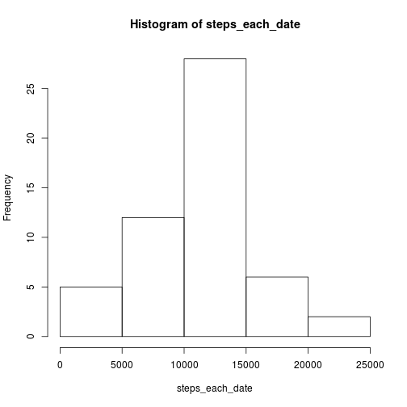
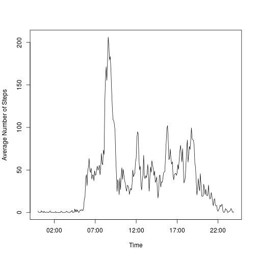
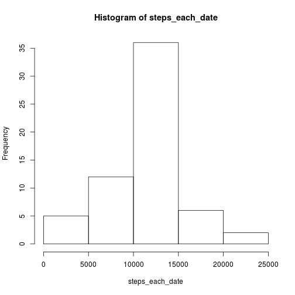
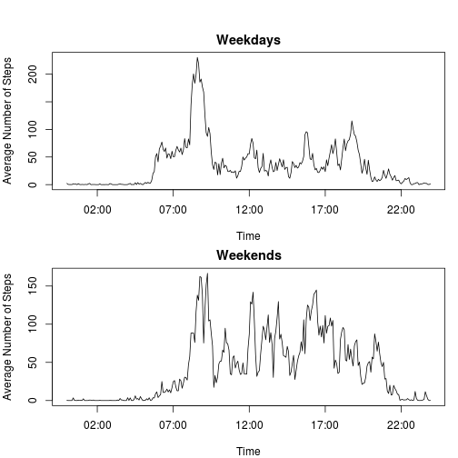

## Loading and preprocessing the data
The data is in a .zip file in the working directory.
Unzipping the .zip file:

```r
unzip("activity.zip")
```

Loading the data from the contents of the .zip file:

```r
data <- read.table("activity.csv", header = TRUE, sep = ",", na.strings = "NA", stringsAsFactors = FALSE)
```
## What is mean total number of steps taken per day?

```r
dates <- unique(data$date)
steps_each_date <- NULL
for (date in dates) {
    steps_this_date <- data[!is.na(data$steps) & data$date == date, 1]
    if (length(steps_this_date) > 0) {
          steps_each_date <- append(steps_each_date, sum(steps_this_date))
    }
}
```

```r
mean(steps_each_date)
```

```
## [1] 10766.19
```

```r
median(steps_each_date)
```

```
## [1] 10765
```

```r
hist(steps_each_date)
```

 

## What is the average daily activity pattern?

```r
intervals <- unique(data$interval)
avg_steps_each_interval <- NULL
for (interval in intervals) {
    steps_this_interval <- data[!is.na(data$steps) & data$interval == interval, 1]
    avg_steps_each_interval <- append(avg_steps_each_interval, mean(steps_this_interval))
}

intervals <- sprintf("%04d", intervals)
date_times <- paste(data$date, intervals)
date_times_formatted <- strptime(date_times, format = "%Y-%m-%d %H%M")
times <- unique(format(date_times_formatted, "%H:%M"))
times <- strptime(times, format = "%H:%M")

plot(times, avg_steps_each_interval, type="l", xlab = "Time", ylab = "Average Number of Steps")
```

 

"Which 5-minute interval, on average across all the days in the dataset, contains the maximum [average] number of steps?"

```r
most_active_interval <- times[avg_steps_each_interval == max(avg_steps_each_interval)]
most_active_interval <- format(most_active_interval, "%H:%M")
most_active_interval
```

```
## [1] "08:35"
```
The maximum average number of steps:

```r
max(avg_steps_each_interval)
```

```
## [1] 206.1698
```
## Imputing missing values
The number of missing values in the dataset:

```r
length(data[is.na(data$steps), 1])
```

```
## [1] 2304
```

Filling in missing NA values:

```r
data_NAs_replaced <- data
number_of_rows <- length(data[,1])
for (row_index in seq(1, number_of_rows)) {
  if (is.na(data[row_index, 1])) {
    interval <- data[row_index, 3]
    interval_formatted <- sprintf("%04d", interval)
    date_time <- paste(data[row_index, 2], interval_formatted)
    date_time_formatted <- strptime(date_time, format = "%Y-%m-%d %H%M")
    time <- format(date_time_formatted, "%H:%M")
    time <- strptime(time, format = "%H:%M")
    avg_step_this_interval <- avg_steps_each_interval[times == time]
    data_NAs_replaced[row_index, 1] <- avg_step_this_interval
  }
}
```


```r
steps_each_date <- NULL
for (date in dates) {
    steps_this_date <- data_NAs_replaced[!is.na(data_NAs_replaced$steps) & data_NAs_replaced$date == date, 1]
    if (length(steps_this_date) > 0) {
          steps_each_date <- append(steps_each_date, sum(steps_this_date))
    }
}
```

```r
mean(steps_each_date)
```

```
## [1] 10766.19
```

```r
median(steps_each_date)
```

```
## [1] 10766.19
```

```r
hist(steps_each_date)
```

 

Replacing NAs with the corresponding interval average does not affect the mean or median, but it does increase the height of each histogram bar.

## Are there differences in activity patterns between weekdays and weekends?


```r
data_NAs_replaced$type_of_day <- weekdays(strptime(data$date, format = "%Y-%m-%d"))
```


```r
intervals <- unique(data$interval)
avg_steps_each_interval <- NULL
for (interval in intervals) {
    steps_this_interval <- data_NAs_replaced$steps[!(data_NAs_replaced$type_of_day %in% c("Saturday", "Sunday")) & data$interval == interval]
    avg_steps_each_interval <- append(avg_steps_each_interval, mean(steps_this_interval))
}

intervals <- sprintf("%04d", intervals)
date_times <- paste(data_NAs_replaced$date[!(data_NAs_replaced$type_of_day %in% c("Saturday", "Sunday"))], intervals)
date_times_formatted <- strptime(date_times, format = "%Y-%m-%d %H%M")
times <- unique(format(date_times_formatted, "%H:%M"))
times <- strptime(times, format = "%H:%M")

par(mfrow = c(2, 1), mar = c(4, 4, 2, 1), oma = c(0, 0, 2, 0))
plot(times, avg_steps_each_interval, type="l", xlab = "Time", ylab = "Average Number of Steps", main = "Weekdays")


intervals <- unique(data$interval)
avg_steps_each_interval <- NULL
for (interval in intervals) {
    steps_this_interval <- data_NAs_replaced$steps[data_NAs_replaced$type_of_day %in% c("Saturday", "Sunday") & data$interval == interval]
    avg_steps_each_interval <- append(avg_steps_each_interval, mean(steps_this_interval))
}

intervals <- sprintf("%04d", intervals)
date_times <- paste(data_NAs_replaced$date[data_NAs_replaced$type_of_day %in% c("Saturday", "Sunday")], intervals)
date_times_formatted <- strptime(date_times, format = "%Y-%m-%d %H%M")
times <- unique(format(date_times_formatted, "%H:%M"))
times <- strptime(times, format = "%H:%M")

plot(times, avg_steps_each_interval, type="l", xlab = "Time", ylab = "Average Number of Steps", main = "Weekends")
```

 
